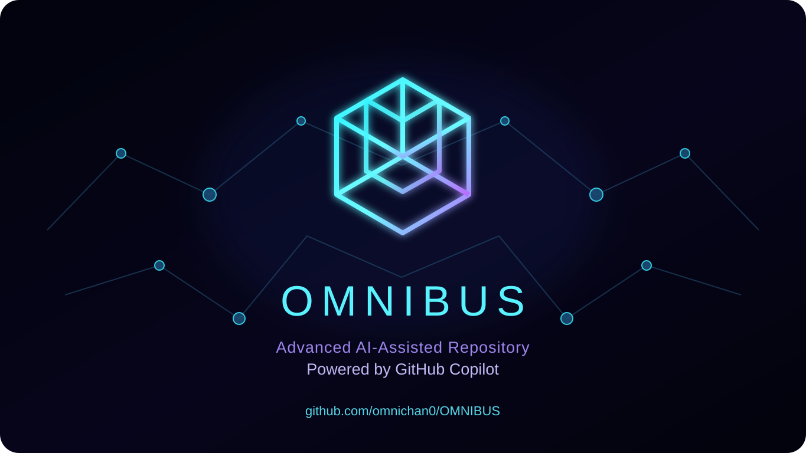

# OMNIBUS

<p align="center">
  
</p>

[](https://github.com/omnichan0/OMNIBUS/actions/workflows/sanity.yml)

OMNIBUS is an extensible AI-agent platform foundation. Its primary implementation, **Sovereign AI Factory**, provides a portable runtime for capability discovery, provider adapters, policy-controlled execution, persistent state, and secure deployment across Linux, Google Colab, Windows/WSL2, and optional Docker environments.

> **New here? Start with [`START_HERE.md`](START_HERE.md).** It contains the copy-and-paste path for Colab, Linux, and Windows/WSL2.

## Highlights

- **Registry-driven capabilities** configured through YAML
- **Runtime provider discovery** through manifests and entry points
- **Risk-based approval gates** for high-risk providers and actions
- **Policy-aware execution** with direct and optional Docker backends
- **Persistent provider state** and approval records outside Git
- **Colab-friendly deployment** with optional Google Drive persistence
- **Open WebUI as the primary user interface**
- **Security-oriented defaults** for secrets, public tunnels, and authorized data sources

## Quick start

### Google Colab

```python
from google.colab import drive
drive.mount('/content/drive')

!git clone https://github.com/omnichan0/OMNIBUS.git /content/OMNIBUS
%cd /content/OMNIBUS
!chmod +x install.sh
!./install.sh
```

### Linux

```bash
git clone https://github.com/omnichan0/OMNIBUS.git
cd OMNIBUS
chmod +x install.sh
./install.sh
```

The installer asks for an optional ngrok token for a public URL. Press Enter to use private/local mode. It provisions or restores the runtime components it can, downloads public GGUF models with resumable retries, and runs validation before presenting the service URL.

`HF_TOKEN` is not required for the ordinary GGUF setup. It is an optional agent credential for later Hugging Face Spaces, HF MCP/tools, gated/private resources, or other authenticated capabilities.

### Windows

The supported Windows path uses WSL2. Install it in PowerShell with `wsl --install`, restart if requested, then open Ubuntu/WSL and follow the Linux instructions.

## Repository layout

```text
OMNIBUS/
├── START_HERE.md
├── README.md
├── assets/
├── install.sh
├── install.ps1
├── core/
├── bootstrap/
├── adapters/
├── models/
└── sovereign-ai-factory/
    ├── README.md
    ├── pyproject.toml
    ├── config/
    ├── src/sovereign/
    └── tests/
```

## Automatic provisioning

The bootstrap detects the environment and provisions missing system tools, Python/virtualenv, Open WebUI, llama.cpp, Node/Cline, optional ngrok, and the configured GGUF models. On Colab, Drive caches can restore models, the environment, llama.cpp, chats, and runtime state after a session restart.

GGUF downloads use public Hugging Face resolve URLs by default. They are selected from the configured repositories, resumed after interruption, retried on transient failures, and kept outside Git. See [`models/README.md`](models/README.md) for the model policy.

## Security

- Keep `NGROK_TOKEN`, `HF_TOKEN`, API keys, and other secrets outside Git.
- Expose only Open WebUI through a public tunnel unless additional endpoints are explicitly protected.
- Keep administrative, shell, computer-use, MCP, and backend endpoints local or authenticated.
- Use only public or authorized data sources.
- Review third-party licenses and provider terms before enabling integrations.

## Runtime commands

```bash
python3 core/sovereign_hive_factory.py --status
python3 core/sovereign_hive_factory.py --url
python3 core/sovereign_hive_factory.py --sync
python3 core/sovereign_hive_factory.py --stop
```

Detailed runtime documentation is in [`sovereign-ai-factory/README.md`](sovereign-ai-factory/README.md).
